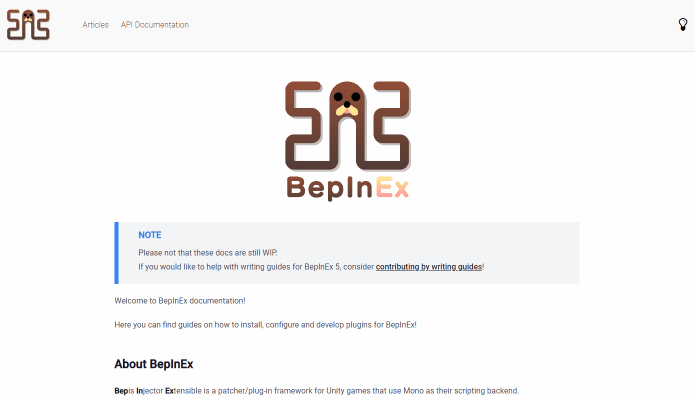

# BepInEx DocFx template

A **WIP** template for new BepInEx documentation!

## Features

This is a rewrite of the default DocFx template with emphasis on usage of HTML5/CSS3 instead of JavaScript for its functionality.

Most important differences from the default DocFx template (and most other templates available on the net):

* Removed dependency on jQuery and Bootstrap
* Uses [TypeScript](https://www.typescriptlang.org/) for scripts and [Tailwind](https://tailwindcss.com/) for styles
* TOC is now generated statically instead of relying on JS
* Layout made with CSS Grids for simplicty
* Added dark mode switch

## Editing the template

To edit the template, you need to `npm install` required tools.  
This template depends on the following libraries/tools:

* TypeScript -- used to build scripts and bundle them into a single file
* Tailwind and PostScript -- used to build style file

All source files are in `bepin_new/lib` folder. When editing, keep in the following in mind:

* Avoid using Tailwind classes in HTML. Instead, use `@apply` rule in `.css` files to apply styles to elements to reduce the amount of final CSS styles emitted.
* Do not use Font Awesome or other icon libraries directly. Instead, use [Fontello](https://fontello.com/) to bundle only required icons.

To build the template styles and scripts, run `npm run build_prod`.